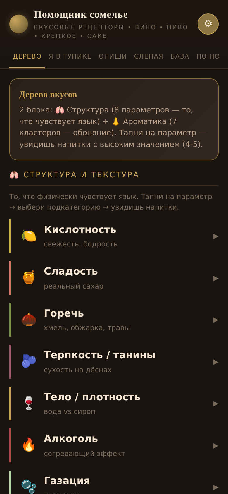
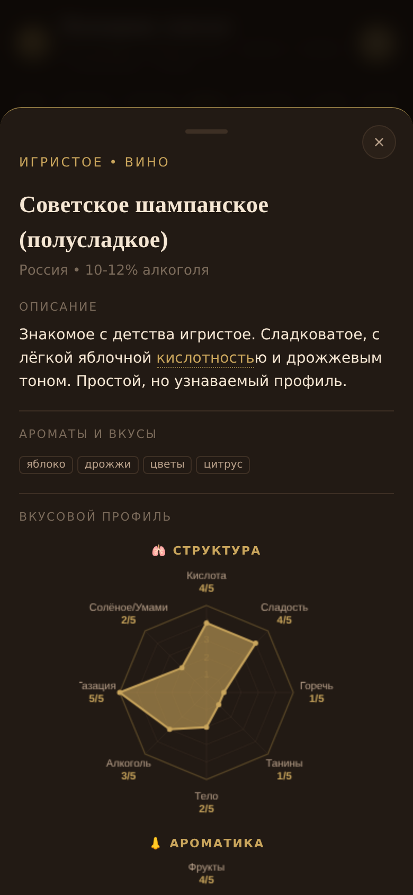
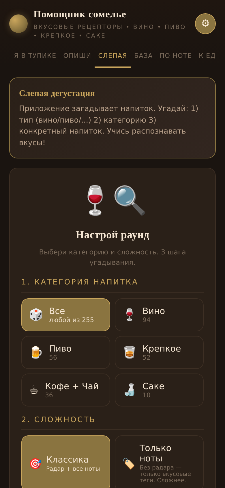
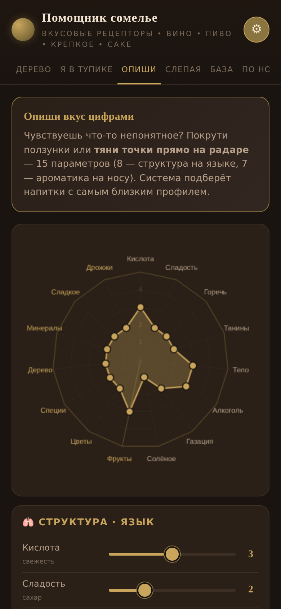
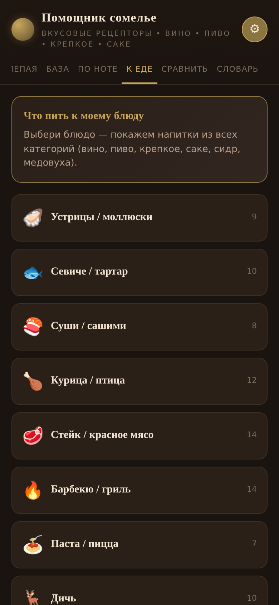
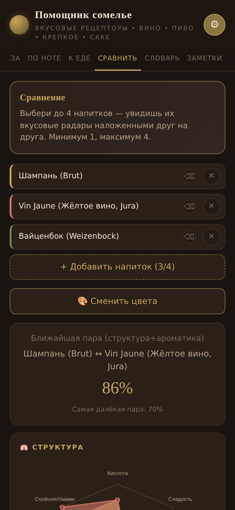

# 🍷 Помощник сомелье

**Учимся распознавать вкусы напитков.** Вино, пиво, крепкое, кофе, чай — через 7+7 осей: 🫁 структура (язык) + 👃 ароматика (нос). Без сервера, без рекламы, работает офлайн.

🔗 **Попробовать:** https://latitude-53.github.io/sommelier-app/

## 🎮 Две игры

### 🍷 Дегустация (слепая)
Загадываем напиток — угадывай за 3 шага: тип → категория → конкретное название.
- 4 уровня сложности: 🎯 Классика · 🏷️ Только ноты · 📊 Только профиль · 🏆 Эксперт (×2 очков)
- 3 режима: 1 раунд / Серия ×5 / Марафон ×10
- 6 категорий: Все / Вино / Пиво / Крепкое / Кофе+Чай / Саке

### 🎯 Построй профиль
Дано полное описание напитка — восстанови его вкусовой профиль ползунками.
- 3 режима: 🎯 Оба (14 осей, ×2) · 🫁 Структура · 👃 Ароматика
- Двойная паутина в финале: твоё (золото) vs реальное (синий)
- ×2 за сложный режим + ×2 за полный профиль (×4 стек!)

## 🛠️ Что ещё внутри

- **🌳 Дерево** — 7 параметров структуры + 7 кластеров ароматики
- **❓ Я в тупике** — квиз из 5 вопросов → типаж + похожие напитки
- **✏️ Опиши** — конструктор профиля с draggable точками → similar drinks
- **📚 База** — 255 напитков с avatar-карточками
- **🏷️ По ноте** — облако тегов → напитки с этой нотой во всех категориях
- **🍽️ К еде** — 29 блюд → напитки из всех категорий
- **📊 Сравнить** — до 4 напитков с наложенными радарами
- **📖 Словарь** — 180 терминов с объяснениями
- **📝 Заметки** — сохраняются локально

## 📸 Скриншоты

<table>
  <tr>
    <td></td>
    <td></td>
    <td></td>
  </tr>
  <tr>
    <td align="center">🌳 Дерево</td>
    <td align="center">🍷 Карточка</td>
    <td align="center">🍷 Слепая</td>
  </tr>
  <tr>
    <td></td>
    <td></td>
    <td></td>
  </tr>
  <tr>
    <td align="center">✏️ Опиши</td>
    <td align="center">🍽️ К еде</td>
    <td align="center">📊 Сравнить</td>
  </tr>
</table>

> *Скриншоты с v1.0.x — UI обновился в v1.1.x (chess.com-стиль).*

## 🌐 Перевод

UI на русском. В Settings (⚙) — **Google Translate** на 8 языков: English, Español, Français, Deutsch, Italiano, Português, 日本語, 中文.

## 📊 Цифры

- **255 напитков** в 8 категориях (вино, пиво, крепкое, саке, сидр, медовуха, кофе, чай)
- **11 вкладок** — 2 игры + 9 инструментов
- **180 терминов** в словаре
- **29 блюд** в pairing
- **~545 KB** — один HTML-файл, 0 зависимостей

---

## 🚀 Разработка / Android-сборка

<details>
<summary><b>📐 Структура проекта</b></summary>

```
sommelier-app/
├── www/index.html              # финальный файл (single HTML, ~545 KB)
├── scripts/
│   ├── build.py                # генератор: JSON → HTML
│   ├── template.html           # HTML структура + CSS
│   └── app.js                  # JS логика
├── data/                       # редактируемые JSON
│   ├── drinks.json             # 255 напитков
│   ├── taxonomy.json           # дерево вкусов
│   ├── glossary.json           # 180 терминов
│   ├── dish_pairs.json         # 29 блюд
│   ├── quiz.json               # вопросы квиза
│   └── blind_modes.json        # 4 режима сложности
├── docs/                       # GitHub Pages (копия www/)
├── build-apk.bat / .ps1        # сборка APK двойным кликом
├── install-icon.bat / .ps1     # установка иконки
├── setup-jdk.bat / .ps1        # авто-скачивание JDK 17
└── capacitor.config.json       # Android-обёртка
```

</details>

<details>
<summary><b>🌐 Веб-версия (быстрый старт)</b></summary>

```bash
python3 scripts/build.py
# открой www/index.html в браузере
```

</details>

<details>
<summary><b>📝 Редактирование датасета</b></summary>

1. Открой любой `data/*.json` в текстовом редакторе (или `www/admin.html`)
2. Внеси изменения
3. Запусти `python3 scripts/build.py`
4. Готово — `www/index.html` обновлён

</details>

<details>
<summary><b>🤖 Android-сборка (Capacitor)</b></summary>

**Требования:** Node.js 18+, Android Studio, JDK 17+

```bash
npm install                  # зависимости
npm run android:init         # создать android/ проект
npm run android:sync         # синхронизировать (после изменений)
npm run android:open         # открыть в Android Studio
# ИЛИ сразу собрать APK:
npm run android:build        # → android/app/build/outputs/apk/debug/app-debug.apk
```

**Простой путь (Windows):** двойной клик по `build-apk.bat` — автоматически скачает JDK 17, соберёт APK.

</details>

<details>
<summary><b>🏪 Публикация в Google Play</b></summary>

1. Создай аккаунт разработчика ($25 один раз): https://play.google.com/console
2. Сгенерируй подписанный AAB:
   ```bash
   cd android
   ./gradlew bundleRelease
   ```
   → `android/app/build/outputs/bundle/release/app-release.aab`
3. Загрузи AAB через Play Console
4. Модерация 1-3 дня

</details>

<details>
<summary><b>🔧 Технологии</b></summary>

- **HTML5 + CSS3 + vanilla JavaScript** (0 зависимостей, single file)
- **Canvas API** для радар-чартов с HTML overlay для лейблов
- **localStorage** для заметок, темы, настроек
- **Capacitor 6** для Android-обёртки
- **Google Translate Widget** для i18n без сервера

</details>

<details>
<summary><b>📈 Roadmap</b></summary>

- [ ] **Daily Tasting** — напиток дня (один для всех, hash от даты)
- [ ] **Higher/Lower** — quick-игра с серией ответов
- [ ] **Профиль** — stats, achievements, history
- [ ] **Tournament** — bracket из 16 напитков
- [ ] **Расширение базы** — до 400+ напитков
- [ ] **iOS версия**
- [ ] **Remote JSON** — обновление базы без APK

</details>

## 📜 Лицензия

MIT
