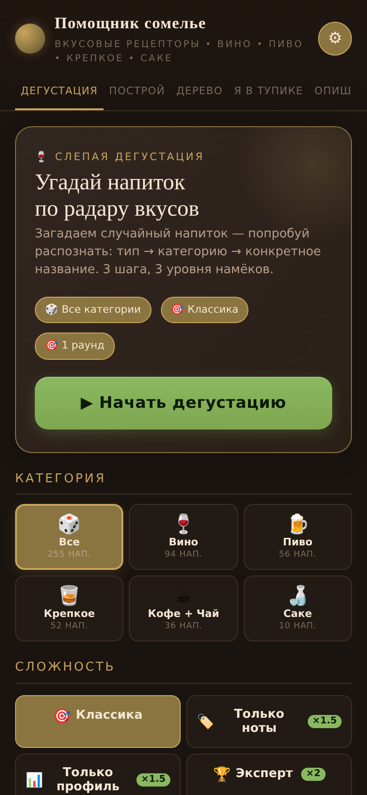
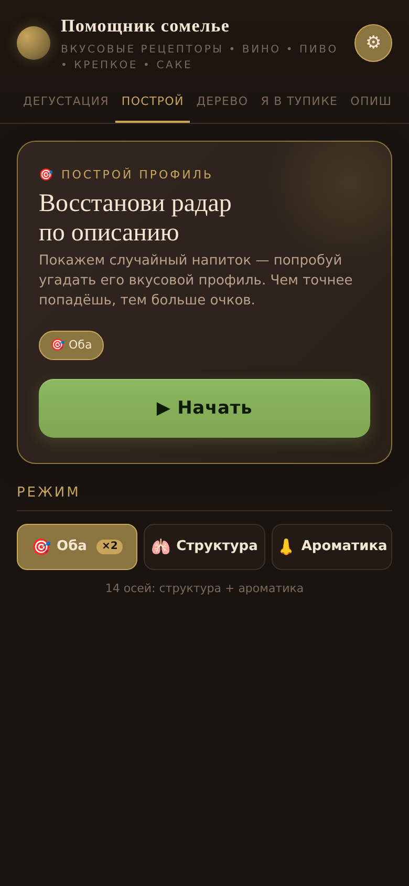
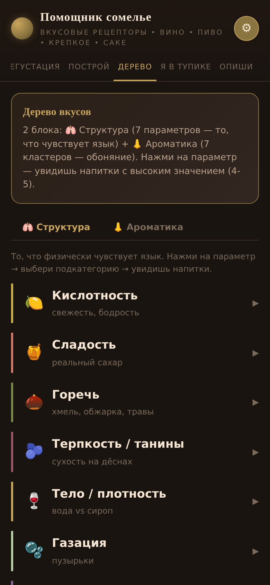
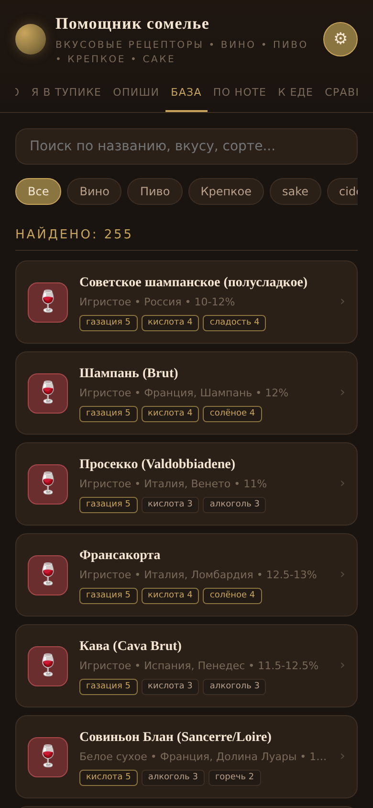
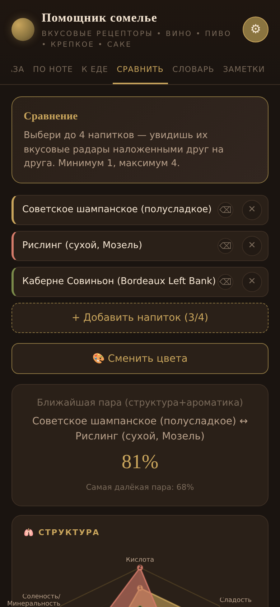
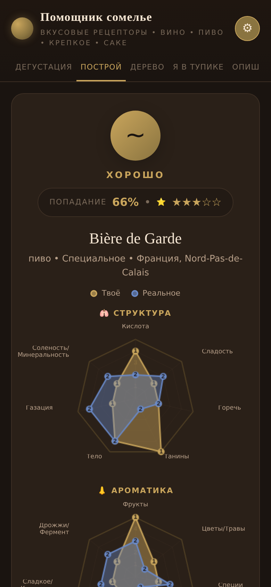

# 🍷 Помощник сомелье

**Учимся распознавать вкусы напитков.** Вино, пиво, крепкое, кофе, чай — через 7+7 осей: 🫁 структура (язык) + 👃 ароматика (нос). Без сервера, без рекламы, работает офлайн.

🔗 **Попробовать:** https://latitude-53.github.io/sommelier-app/

## 🎮 Две игры

### 🍷 Дегустация (слепая)
Загадываем напиток — угадывай за 3 шага: тип → категория → конкретное название.
- 4 уровня сложности: 🎯 Классика · 🏷️ Только ноты · 📊 Только профиль · 🏆 Эксперт (×2 очков)
- 3 режима: 1 раунд / Серия ×5 / Марафон ×10
- 6 категорий: Все / Вино / Пиво / Крепкое / Кофе+Чай / Саке

### 🎯 Построй профиль
Дано полное описание напитка — восстанови его вкусовой профиль ползунками.
- 3 режима: 🎯 Оба (14 осей, ×2) · 🫁 Структура · 👃 Ароматика
- Двойная паутина в финале: твоё (золото) vs реальное (синий)
- ×2 за сложный режим + ×2 за полный профиль (×4 стек!)

## 🛠️ Что ещё внутри

- **🌳 Дерево** — 7 параметров структуры + 7 кластеров ароматики
- **❓ Я в тупике** — квиз из 5 вопросов → типаж + похожие напитки
- **✏️ Опиши** — конструктор профиля с draggable точками → similar drinks
- **📚 База** — 255 напитков с avatar-карточками
- **🏷️ По ноте** — облако тегов → напитки с этой нотой во всех категориях
- **🍽️ К еде** — 29 блюд → напитки из всех категорий
- **📊 Сравнить** — до 4 напитков с наложенными радарами
- **📖 Словарь** — 180 терминов с объяснениями
- **📝 Заметки** — сохраняются локально

## 📸 Скриншоты

<table>
  <tr>
    <td></td>
    <td></td>
    <td></td>
  </tr>
  <tr>
    <td align="center">🍷 Дегустация</td>
    <td align="center">🎯 Построй (setup)</td>
    <td align="center">🌳 Дерево</td>
  </tr>
  <tr>
    <td></td>
    <td></td>
    <td></td>
  </tr>
  <tr>
    <td align="center">📚 База</td>
    <td align="center">📊 Сравнить</td>
    <td align="center">🎯 Построй (reveal)</td>
  </tr>
</table>

## 🌐 Перевод

UI на русском. В Settings (⚙) — **Google Translate** на 8 языков: English, Español, Français, Deutsch, Italiano, Português, 日本語, 中文.

## 📊 Цифры

- **322 напитка** в 8 категориях (вино, пиво, крепкое, саке, сидр, медовуха, кофе, чай)
- **768 ингредиентов** (332 винограда, 357 яблок, 37 хмелей, 10 агав, 12 чаёв, 12 кофе, 8 риса)
- **2031 регион** с координатами (1831 wine + 172 beer + 25 coffee)
- **108 стилей пива** с профилями 7+7
- **11 вкладок** — 2 игры + 9 инструментов
- **180 терминов** в словаре
- **29 блюд** в pairing
- **~602 KB** — один HTML-файл, 0 зависимостей

---

## 🚀 Разработка / Android-сборка

<details>
<summary><b>📐 Структура проекта</b></summary>

```
sommelier-app/
├── www/index.html              # финальный файл (single HTML, ~602 KB)
├── scripts/
│   ├── build.py                # генератор: JSON → HTML
│   ├── template.html           # HTML структура + CSS
│   └── app.js                  # JS логика
├── data/                       # редактируемые JSON
│   ├── drinks.json             # 322 напитка
│   ├── ingredients.json        # 768 ингредиентов (виноград, хмель, агава, и т.д.)
│   ├── wine_regions.json       # 1831 винодельческий регион
│   ├── beer_regions.json       # 172 пивоваренных региона
│   ├── coffee_regions.json     # 25 кофе-регионов
│   ├── beer_styles_profiles.json # 108 стилей пива с профилями 7+7
│   ├── taxonomy.json           # дерево вкусов
│   ├── glossary.json           # 180 терминов
│   ├── dish_pairs.json         # 29 блюд
│   ├── quiz.json               # вопросы квиза
│   └── blind_modes.json        # 4 режима сложности
├── docs/                       # GitHub Pages (копия www/)
├── build-apk.bat / .ps1        # сборка APK двойным кликом
├── install-icon.bat / .ps1     # установка иконки
├── setup-jdk.bat / .ps1        # авто-скачивание JDK 17
└── capacitor.config.json       # Android-обёртка
```

</details>

<details>
<summary><b>🌐 Веб-версия (быстрый старт)</b></summary>

```bash
python3 scripts/build.py
# открой www/index.html в браузере
```

</details>

<details>
<summary><b>📝 Редактирование датасета</b></summary>

1. Открой любой `data/*.json` в текстовом редакторе (или `www/admin.html`)
2. Внеси изменения
3. Запусти `python3 scripts/build.py`
4. Готово — `www/index.html` обновлён

</details>

<details>
<summary><b>🤖 Android-сборка (Capacitor)</b></summary>

**Требования:** Node.js 18+, Android Studio, JDK 17+

```bash
npm install                  # зависимости
npm run android:init         # создать android/ проект
npm run android:sync         # синхронизировать (после изменений)
npm run android:open         # открыть в Android Studio
# ИЛИ сразу собрать APK:
npm run android:build        # → android/app/build/outputs/apk/debug/app-debug.apk
```

**Простой путь (Windows):** двойной клик по `build-apk.bat` — автоматически скачает JDK 17, соберёт APK.

</details>

<details>
<summary><b>📈 Roadmap</b></summary>

- [ ] **Daily Tasting** — напиток дня (один для всех, hash от даты)
- [ ] **Higher/Lower** — quick-игра с серией ответов
- [ ] **Профиль** — stats, achievements, history
- [ ] **Tournament** — bracket из 16 напитков
- [ ] **Расширение базы** — до 400+ напитков
- [ ] **iOS версия**
- [ ] **Remote JSON** — обновление базы без APK

</details>

## 📜 Лицензия

MIT License — Copyright © 2025 Latitude-53

## 📊 Данные и атрибуция

Этот проект использует открытые датасеты. Все источники указаны в соответствии с их лицензиями (MIT / CC BY-SA 4.0 / CC BY 4.0).

### 🗺️ Wine regions (1831 регион)

Координаты винодельческих регионов извлечены из:

- **Winery Map** © 2024 Oliver Dressler
- License: [MIT](https://github.com/oOo0oOo/winerymap/blob/main/LICENSE)
- Source: https://github.com/oOo0oOo/winerymap
- 34 000 виноделен в 2 078 регионах мира → 1 831 регион с координатами
- Топ-5 стран: Франция (443), Италия (405), США (206), Австралия (95), ЮАР (73)

### 🍺 Beer regions (172 региона)

Координаты пивоварен извлечены из:

- **Open Brewery DB** © 2025 Open Brewery DB
- License: [MIT](https://github.com/openbrewerydb/openbrewerydb/blob/master/LICENSE)
- Source: https://github.com/openbrewerydb/openbrewerydb
- 11 745 пивоварен в 23 странах → 172 региона с координатами
- Топ-5: США (51), Германия (16), Ирландия (16), Новая Зеландия (15), Финляндия (14)

### ☕ Coffee regions (25 регионов)

Координаты кофе-регионов извлечены из:

- **Coffee Quality Database** © 2018 James LeDoux
- License: [MIT](https://github.com/jldbc/coffee-quality-database/blob/master/LICENSE)
- Source: https://github.com/jldbc/coffee-quality-database
- 1 311 кофе с рейтингами Coffee Quality Institute → 25 стран-производителей
- Топ-5: Мексика (184), Колумбия (176), Гватемала (174), Бразилия (123), Гавайи (73)

### 🍇 Ingredients (768 ингредиентов)

| Тип | Кол-во | Источник | Лицензия |
|---|---|---|---|
| 🍇 Виноград | 332 | Wikipedia [List of grape varieties](https://en.wikipedia.org/wiki/List_of_grape_varieties) | [CC BY-SA 4.0](https://creativecommons.org/licenses/by-sa/4.0/) |
| 🍏 Яблоки | 357 | Wikipedia [List of apple cultivars](https://en.wikipedia.org/wiki/List_of_apple_cultivars) | [CC BY-SA 4.0](https://creativecommons.org/licenses/by-sa/4.0/) |
| 🌿 Хмель | 37 | [HopDatabase](https://github.com/kasperg3/HopDatabase) © 2024 Kasper Andreas Rømer Grøntved | [MIT](https://github.com/kasperg3/HopDatabase/blob/master/LICENSE) |
| 🌵 Агава | 10 | Ручная курификация + Wikipedia | [CC BY-SA 4.0](https://creativecommons.org/licenses/by-sa/4.0/) |
| 🍵 Чай | 12 | Ручная курификация + Wikipedia | [CC BY-SA 4.0](https://creativecommons.org/licenses/by-sa/4.0/) |
| ☕ Кофе | 12 | Ручная курификация + Wikipedia | [CC BY-SA 4.0](https://creativecommons.org/licenses/by-sa/4.0/) |
| 🌾 Рис | 8 | Ручная курификация (sake rice) | факты (не охраняются) |

Каждый ингредиент имеет координаты (lat/lng) для будущей карты.

### 🍺 Beer style profiles (108 стилей с профилями 7+7)

Средние вкусовые профили 108 стилей пива, рассчитанные из:

- **Beer Profile and Ratings Data Set** © ruthgn
- License: [CC BY 4.0](https://creativecommons.org/licenses/by/4.0/)
- Source: https://www.kaggle.com/datasets/ruthgn/beer-profile-and-ratings-data-set
- 3 197 пив с tasting profiles → 108 стилей с усреднёнными профилями
- Маппинг на 7+7: Sour→acid, Sweet→sweet, Bitter→bitter, Astringency→tannin, Body→body, Salty→savory, Fruits→fruit, Spices→spice, Malty→sweet_pastry

### 🍷 Drinks (322 напитка)

Собрано и курировано вручную автором проекта. Описания написаны на русском языке.

- 109 вин (Бордо, Бургундия, Тоскана, Кьянти, Пьемонт, Долина Роны, Напа, и т.д.)
- 69 пив (Лагер, Эль, Стаут, IPA, Lambic, Trappist, Saison, и т.д.)
- 64 крепких (Виски, Коньяк, Ром, Джин, Текила, Мескаль, Арманьяк, и т.д.)
- 25 чаёв, 21 кофе, 14 саке, 12 сидров, 8 медовух

### ❌ Не использованы (по лицензионным соображениям)

- **X-Wines** (100k вин) — academic citation required, нет прозрачности по происхождению данных
- **Wine Enthusiast / winemag 10k** — данные скраплены с сайта без разрешения (ToS violation)
